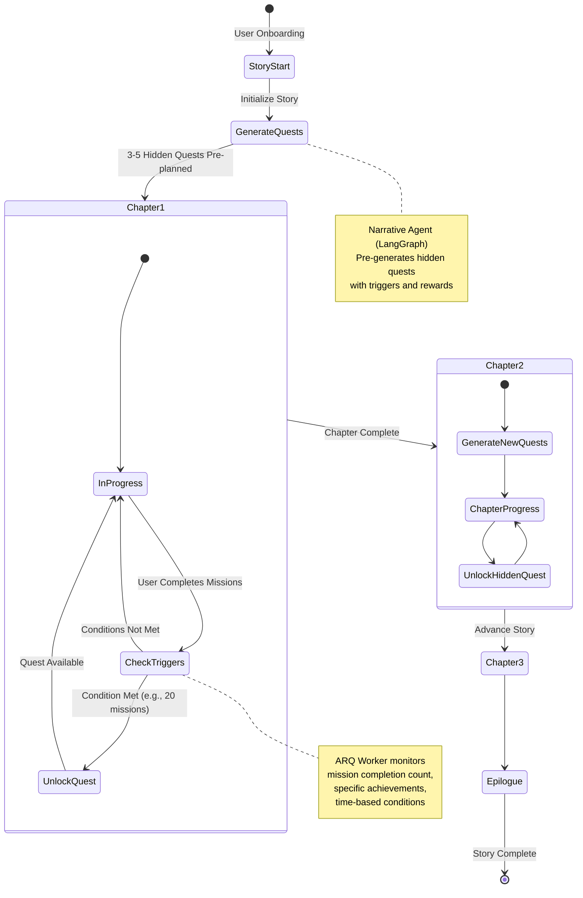
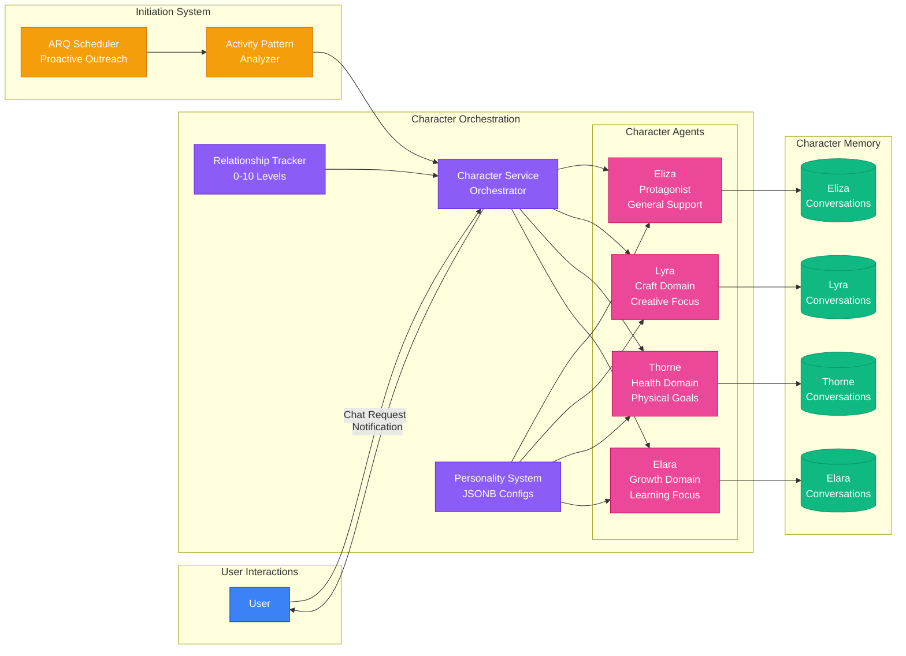
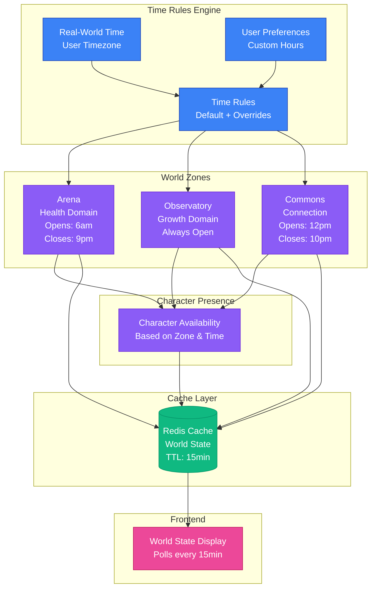
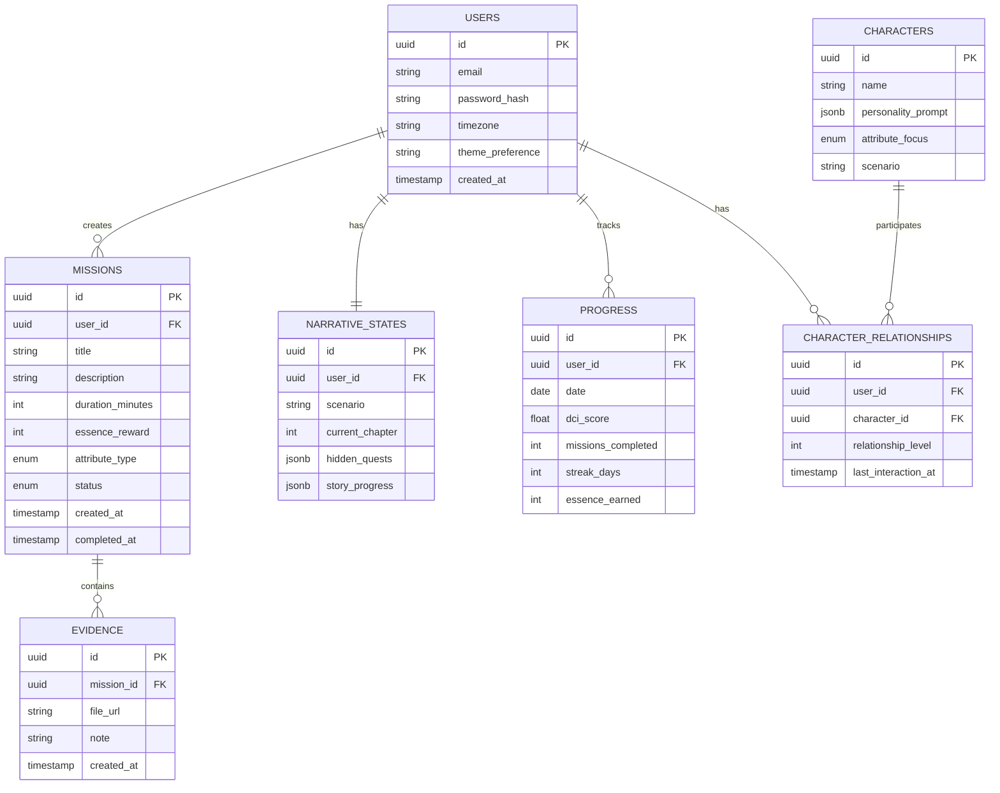
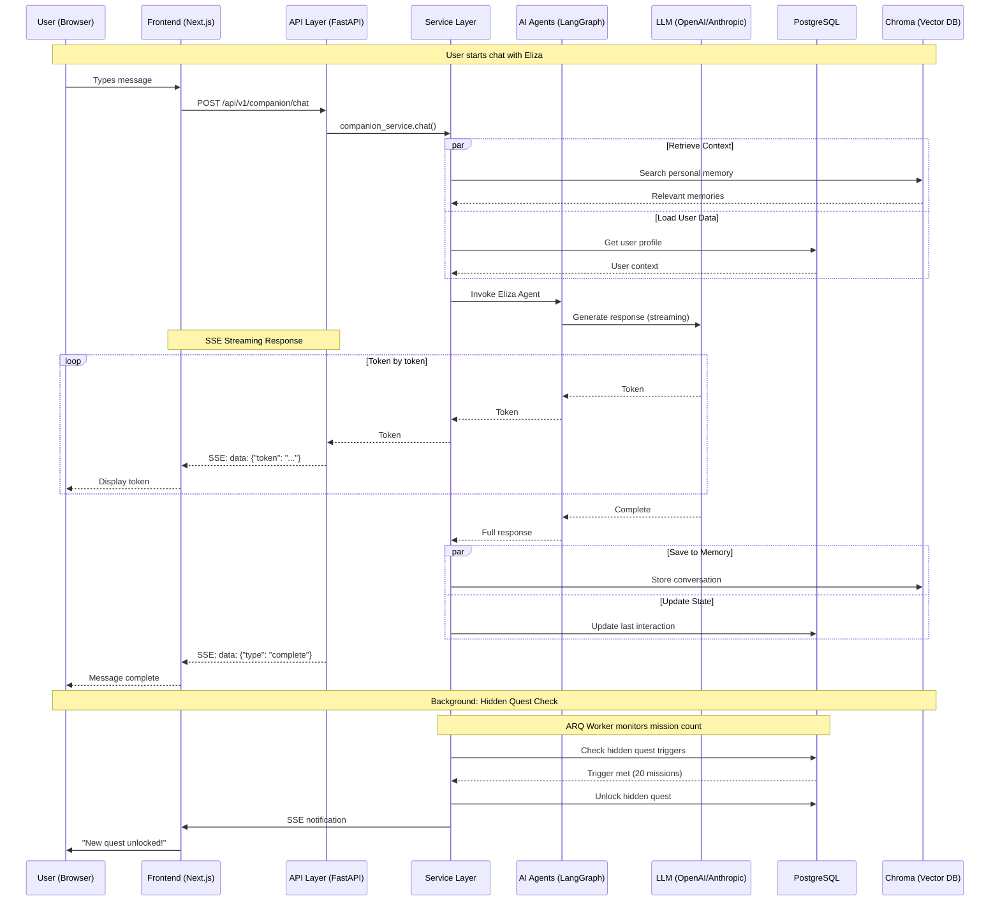
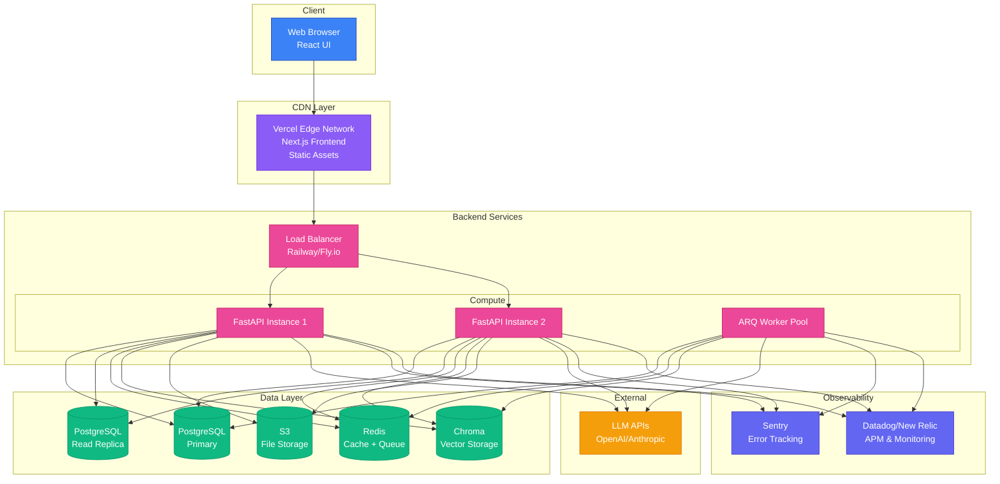

# Delight - Comprehensive Architecture Diagram

## Full System Architecture

```mermaid
graph TB
    subgraph "Frontend Layer - Next.js 15 + React 19"
        UI[UI Components<br/>shadcn/ui + Framer Motion]
        APP[App Router<br/>Routes & Pages]
        HOOKS[React Hooks<br/>State Management]
        API_CLIENT[API Client<br/>REST + SSE]
        THEMES[Theme System<br/>Medieval/Sci-Fi]
    end

    subgraph "Backend Layer - FastAPI"
        subgraph "API Endpoints"
            API_COMPANION[Companion API<br/>/api/v1/companion]
            API_MISSIONS[Missions API<br/>/api/v1/missions]
            API_NARRATIVE[Narrative API<br/>/api/v1/narrative]
            API_WORLD[World API<br/>/api/v1/world]
            API_PROGRESS[Progress API<br/>/api/v1/progress]
            SSE[SSE Streaming<br/>/api/v1/sse/*]
        end

        subgraph "Services Layer"
            SVC_COMPANION[Companion Service<br/>Eliza Orchestration]
            SVC_NARRATIVE[Narrative Service<br/>Story Generation]
            SVC_MISSION[Mission Service<br/>Quest Logic]
            SVC_CHARACTER[Character Service<br/>Multi-Character AI]
            SVC_MEMORY[Memory Service<br/>Chroma Integration]
            SVC_WORLD[World Service<br/>Time-Aware State]
        end
    end

    subgraph "AI Orchestration Layer - LangGraph + LangChain"
        subgraph "LangGraph Agents"
            AGENT_ELIZA[Eliza Agent<br/>Main Companion]
            AGENT_NARRATIVE[Narrative Agent<br/>Story State Machine]
            AGENT_LYRA[Lyra Agent<br/>Craft Focus]
            AGENT_THORNE[Thorne Agent<br/>Health Focus]
            AGENT_ELARA[Elara Agent<br/>Growth Focus]
        end

        LANGCHAIN[LangChain Core<br/>LLM Integration]
    end

    subgraph "Background Jobs Layer - ARQ + Redis"
        WORKER_QUEST[Quest Generator<br/>Pre-plan Hidden Quests]
        WORKER_NUDGE[Nudge Scheduler<br/>Proactive Outreach]
        WORKER_CHARACTER[Character Initiator<br/>AI-Initiated Chats]
        WORKER_MEMORY[Memory Consolidation<br/>Long-term Storage]
    end

    subgraph "Storage Layer"
        subgraph "PostgreSQL Database"
            DB_USERS[(Users)]
            DB_MISSIONS[(Missions)]
            DB_CHARACTERS[(Characters)]
            DB_NARRATIVE[(Narrative States)]
            DB_PROGRESS[(Progress/DCI)]
            DB_RELATIONSHIPS[(Character<br/>Relationships)]
        end

        subgraph "Vector Storage - Chroma"
            CHROMA_PERSONAL[(Personal<br/>Memory)]
            CHROMA_PROJECT[(Project<br/>Memory)]
            CHROMA_TASK[(Task<br/>Memory)]
            CHROMA_CHAR[(Character<br/>Conversations)]
        end

        REDIS[(Redis Cache<br/>World State<br/>Sessions)]
        S3[(S3 Storage<br/>Evidence Files)]
    end

    subgraph "External Services"
        LLM_PROVIDERS[LLM Providers<br/>OpenAI/Anthropic]
    end

    %% Frontend Connections
    UI --> APP
    APP --> HOOKS
    HOOKS --> API_CLIENT
    API_CLIENT --> API_COMPANION
    API_CLIENT --> API_MISSIONS
    API_CLIENT --> API_NARRATIVE
    API_CLIENT --> API_WORLD
    API_CLIENT --> API_PROGRESS
    API_CLIENT --> SSE

    %% API to Services
    API_COMPANION --> SVC_COMPANION
    API_MISSIONS --> SVC_MISSION
    API_NARRATIVE --> SVC_NARRATIVE
    API_WORLD --> SVC_WORLD
    API_PROGRESS --> SVC_MISSION
    SSE --> SVC_COMPANION
    SSE --> SVC_NARRATIVE

    %% Services to AI Layer
    SVC_COMPANION --> AGENT_ELIZA
    SVC_NARRATIVE --> AGENT_NARRATIVE
    SVC_CHARACTER --> AGENT_LYRA
    SVC_CHARACTER --> AGENT_THORNE
    SVC_CHARACTER --> AGENT_ELARA
    SVC_MEMORY --> LANGCHAIN

    %% AI to LangChain
    AGENT_ELIZA --> LANGCHAIN
    AGENT_NARRATIVE --> LANGCHAIN
    AGENT_LYRA --> LANGCHAIN
    AGENT_THORNE --> LANGCHAIN
    AGENT_ELARA --> LANGCHAIN

    %% LangChain to LLM
    LANGCHAIN --> LLM_PROVIDERS

    %% Services to Storage
    SVC_COMPANION --> DB_USERS
    SVC_MISSION --> DB_MISSIONS
    SVC_CHARACTER --> DB_CHARACTERS
    SVC_CHARACTER --> DB_RELATIONSHIPS
    SVC_NARRATIVE --> DB_NARRATIVE
    SVC_MISSION --> DB_PROGRESS
    SVC_WORLD --> REDIS

    %% Memory Service to Vector Storage
    SVC_MEMORY --> CHROMA_PERSONAL
    SVC_MEMORY --> CHROMA_PROJECT
    SVC_MEMORY --> CHROMA_TASK
    SVC_MEMORY --> CHROMA_CHAR

    %% Evidence Storage
    SVC_MISSION --> S3

    %% Background Jobs
    WORKER_QUEST --> DB_NARRATIVE
    WORKER_QUEST --> AGENT_NARRATIVE
    WORKER_NUDGE --> DB_USERS
    WORKER_NUDGE --> SVC_COMPANION
    WORKER_CHARACTER --> DB_CHARACTERS
    WORKER_CHARACTER --> SVC_CHARACTER
    WORKER_MEMORY --> CHROMA_PERSONAL
    WORKER_MEMORY --> CHROMA_PROJECT

    %% Styling
    classDef frontend fill:#3b82f6,stroke:#1e40af,color:#fff
    classDef backend fill:#8b5cf6,stroke:#6d28d9,color:#fff
    classDef ai fill:#ec4899,stroke:#be185d,color:#fff
    classDef storage fill:#10b981,stroke:#059669,color:#fff
    classDef workers fill:#f59e0b,stroke:#d97706,color:#fff
    classDef external fill:#6366f1,stroke:#4338ca,color:#fff

    class UI,APP,HOOKS,API_CLIENT,THEMES frontend
    class API_COMPANION,API_MISSIONS,API_NARRATIVE,API_WORLD,API_PROGRESS,SSE,SVC_COMPANION,SVC_NARRATIVE,SVC_MISSION,SVC_CHARACTER,SVC_MEMORY,SVC_WORLD backend
    class AGENT_ELIZA,AGENT_NARRATIVE,AGENT_LYRA,AGENT_THORNE,AGENT_ELARA,LANGCHAIN ai
    class DB_USERS,DB_MISSIONS,DB_CHARACTERS,DB_NARRATIVE,DB_PROGRESS,DB_RELATIONSHIPS,CHROMA_PERSONAL,CHROMA_PROJECT,CHROMA_TASK,CHROMA_CHAR,REDIS,S3 storage
    class WORKER_QUEST,WORKER_NUDGE,WORKER_CHARACTER,WORKER_MEMORY workers
    class LLM_PROVIDERS external
```

## Living Narrative Engine - Detailed Flow

## Multi-Character AI System

## Time-Aware World State System

## Data Architecture

## API Communication Flow

## Deployment Architecture

---

## Legend

- **Blue**: Frontend Layer (Next.js, React)
- **Purple**: Backend Layer (FastAPI, Services)
- **Pink**: AI Layer (LangGraph Agents)
- **Green**: Storage Layer (PostgreSQL, Chroma, Redis, S3)
- **Orange**: Background Jobs (ARQ Workers)
- **Indigo**: External Services (LLM Providers)

## Key Architectural Patterns

1. **Living Narrative Engine**: Pre-planned hidden quests with trigger-based unlocking
2. **Multi-Character AI**: Separate LangGraph agents for each character with personality/memory
3. **Time-Aware World**: Zones open/close based on real-world time with user overrides
4. **Hybrid Communication**: SSE for AI streaming, HTTP REST for user actions
5. **Memory Hierarchy**: Vector storage (Chroma) + Structured storage (PostgreSQL)
6. **Async-First**: FastAPI + ARQ for background jobs + async SQLAlchemy
