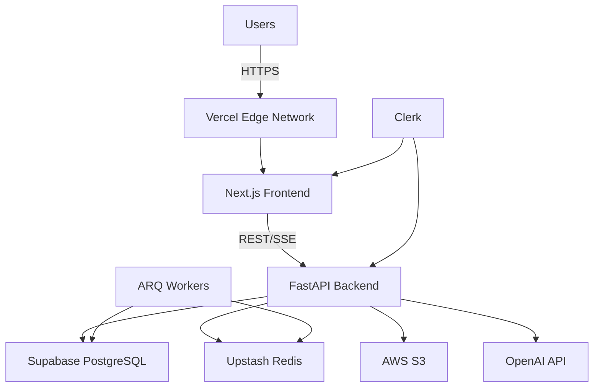

# Deployment Architecture

## Overview

Delight uses a modern, cloud-native deployment strategy with separation between frontend, backend, database, and background services.

## Architecture Diagram



## Environments

### Development (Local)

**Services:**
- Frontend: `http://localhost:3000` (Next.js dev server)
- Backend: `http://localhost:8000` (Uvicorn with `--reload`)
- Database: Supabase cloud or Docker PostgreSQL
- Redis: Docker or Upstash free tier

**Setup:**
```bash
# Frontend
cd packages/frontend
npm run dev

# Backend
cd packages/backend
poetry run uvicorn main:app --reload

# Optional: Local PostgreSQL + Redis
docker-compose up -d
```

### Staging/Preview

**Frontend:**
- Vercel preview deployments (automatic on PR)
- URL: `https://delight-<branch>.vercel.app`

**Backend:**
- Railway preview environments (manual trigger)
- Database: Shared staging PostgreSQL
- Redis: Shared staging Upstash

### Production

**Frontend:**
- Vercel production (edge network)
- URL: `https://app.delight.so`
- CDN: Cloudflare or Vercel Edge

**Backend:**
- Railway or Fly.io (Docker containers)
- URL: `https://api.delight.so`
- Auto-scaling: 2-10 instances based on load

**Database:**
- Supabase Production tier
- Daily backups, point-in-time recovery

**Redis:**
- Upstash Production tier (serverless Redis)

---

## Infrastructure Components

### Frontend (Vercel)

**Why Vercel:**
- Zero-config Next.js deployment
- Edge network (low latency globally)
- Automatic HTTPS/SSL
- Preview deployments per PR
- Built-in analytics

**Configuration:**
```json
// vercel.json
{
  "framework": "nextjs",
  "buildCommand": "pnpm build",
  "devCommand": "pnpm dev",
  "installCommand": "pnpm install",
  "env": {
    "NEXT_PUBLIC_CLERK_PUBLISHABLE_KEY": "@clerk-publishable-key",
    "CLERK_SECRET_KEY": "@clerk-secret-key",
    "NEXT_PUBLIC_API_URL": "https://api.delight.so"
  }
}
```

### Backend (Railway / Fly.io)

**Why Railway/Fly.io:**
- Docker container support
- Automatic deployments from GitHub
- Built-in metrics and logging
- Simple scaling configuration
- Reasonable pricing ($5-20/month for MVP)

**Dockerfile:**
```dockerfile
FROM python:3.11-slim

WORKDIR /app

# Install Poetry
RUN pip install poetry

# Copy dependencies
COPY pyproject.toml poetry.lock ./
RUN poetry install --no-dev

# Copy application
COPY . .

# Run with Uvicorn
CMD ["poetry", "run", "uvicorn", "main:app", "--host", "0.0.0.0", "--port", "8000"]
```

**Environment Variables:**
```bash
DATABASE_URL=postgresql+asyncpg://...
REDIS_URL=redis://...
CLERK_SECRET_KEY=sk_live_...
OPENAI_API_KEY=sk-proj-...
SENTRY_DSN=https://...
ENVIRONMENT=production
```

### Database (Supabase)

**Why Supabase:**
- Managed PostgreSQL with pgvector pre-installed
- Automatic backups and point-in-time recovery
- Built-in connection pooling
- Simple migration from free tier to production
- $25/month for production tier

**Configuration:**
- Connection pooling enabled (max 100 connections)
- Daily backups retained for 7 days
- Point-in-time recovery (PITR) enabled

### Redis (Upstash)

**Why Upstash:**
- Serverless Redis (pay-per-request)
- Global replication for low latency
- Built-in TLS/SSL
- Free tier: 10,000 commands/day
- Production: ~$20/month for typical load

**Use Cases:**
- Background job queue (ARQ)
- Rate limiting
- Session caching (future)

### File Storage (AWS S3)

**Why S3:**
- Industry standard, reliable
- Cheap storage ($0.023/GB/month)
- Pre-signed URLs for secure uploads
- Compatible with CloudFront CDN

**Bucket Structure:**
```
s3://delight-prod/
├── evidence/
│   ├── {user_id}/
│   │   ├── {mission_id}/
│   │   │   └── {filename}
└── avatars/
    └── {user_id}/
        └── profile.jpg
```

---

## Deployment Process

### Frontend (Vercel)

**Automatic:**
1. Push to `main` branch
2. Vercel builds and deploys automatically
3. ~2 minutes to production

**Manual (if needed):**
```bash
pnpm vercel --prod
```

### Backend (Railway)

**Automatic (GitHub Integration):**
1. Push to `main` branch
2. Railway builds Docker image
3. Runs migrations (via startup script)
4. Deploys new containers
5. ~5 minutes to production

**Manual:**
```bash
# Build and push Docker image
docker build -t delight-backend .
docker push registry.railway.app/delight-backend

# Or use Railway CLI
railway up
```

**Migration Strategy:**
```bash
# Run migrations before deployment (in Railway startup script)
poetry run alembic upgrade head

# Then start the server
poetry run uvicorn main:app --host 0.0.0.0 --port 8000
```

### Database Migrations

**Safe Migration Process:**
1. Write migration with `alembic revision --autogenerate`
2. Review generated SQL carefully
3. Test migration on staging database
4. Merge to `main` (triggers deployment)
5. Railway runs migrations automatically before deploy
6. Monitor Sentry for errors

**Rollback:**
```bash
# SSH into Railway container
railway shell

# Rollback migration
poetry run alembic downgrade -1
```

---

## Monitoring & Observability

### Application Monitoring (Sentry)

**What we track:**
- Unhandled exceptions
- API performance (slow queries)
- User sessions (with replay)
- Custom events (mission completions, chat interactions)

**Configuration:**
```python
import sentry_sdk

sentry_sdk.init(
    dsn=SENTRY_DSN,
    environment="production",
    traces_sample_rate=0.1,  # 10% of transactions
    profiles_sample_rate=0.1,
)
```

### Infrastructure Monitoring

**Railway:**
- CPU/memory usage per container
- Request rate and latency
- Error rates

**Supabase:**
- Connection pool usage
- Query performance
- Database size

**Upstash:**
- Command rate
- Latency
- Memory usage

### Logs

**Centralized Logging:**
- Railway: Built-in log aggregation
- Vercel: Function logs via dashboard
- Searchable, filterable by timestamp/level

**Log Levels:**
- `ERROR`: Critical issues (sent to Sentry)
- `WARNING`: Non-critical issues
- `INFO`: Important events (deployments, migrations)
- `DEBUG`: Detailed debugging (dev only)

---

## Scaling Strategy

### Horizontal Scaling

**Backend:**
- Railway: Auto-scale from 2 to 10 instances based on CPU
- Load balancer distributes requests
- Stateless design (sessions in Redis, not memory)

**Database:**
- Supabase: Connection pooling handles load
- Read replicas if needed (future)

### Vertical Scaling

**Database:**
- Start: $25/month tier (2GB RAM, 1 vCPU)
- Scale up: $50/month (8GB RAM, 2 vCPU)

**Redis:**
- Upstash auto-scales with demand (serverless)

### Cost Optimization

**Current Cost (100 users):**
- Vercel: Free tier (10,000 deployments/month)
- Railway: $20/month (backend hosting)
- Supabase: $25/month (database)
- Upstash: $10/month (Redis)
- S3: $5/month (storage)
- OpenAI: $300/month (100 users × $3/user)
- **Total: ~$360/month** ($3.60/user/month)

**Target Cost (1000 users):**
- Vercel: $20/month (Pro plan)
- Railway: $100/month (scaled backend)
- Supabase: $50/month (scaled database)
- Upstash: $50/month (Redis)
- S3: $30/month (storage)
- OpenAI: $3000/month (1000 users × $3/user)
- **Total: ~$3,250/month** ($3.25/user/month)

---

## Security in Production

### SSL/TLS

- ✅ Vercel provides automatic SSL
- ✅ Railway provides automatic SSL
- ✅ Force HTTPS redirect enabled
- ✅ HSTS headers enabled

### Secrets Management

- ✅ Environment variables in Railway/Vercel
- ✅ Never commit secrets to Git
- ✅ Rotate API keys quarterly
- ✅ Use separate keys for dev/staging/prod

### Network Security

- ✅ Database: Supabase firewall (IP whitelist)
- ✅ Redis: TLS-only connections
- ✅ S3: Pre-signed URLs only (no public buckets)

---

## Disaster Recovery

### Backups

**Database:**
- Daily automatic backups (retained 7 days)
- Point-in-time recovery (restore to any time in last 7 days)
- Manual backup before major migrations

**Configuration:**
- Infrastructure as Code (IaC) in Git
- Environment variables documented
- Deployment scripts versioned

### Incident Response

1. **Detection:** Sentry alert or user report
2. **Investigation:** Check logs, metrics
3. **Mitigation:**
   - Rollback deployment if recent change
   - Scale up if performance issue
   - Apply hotfix if critical bug
4. **Communication:** Status page update
5. **Post-mortem:** Document incident, improve monitoring

### Rollback Procedure

**Frontend (Vercel):**
```bash
# Rollback to previous deployment (via Vercel dashboard)
# Or redeploy specific commit
vercel --prod --force
```

**Backend (Railway):**
```bash
# Rollback to previous deployment (via Railway dashboard)
# Or manually:
railway rollback
```

**Database:**
```bash
# Rollback migration
poetry run alembic downgrade -1

# Or restore from backup (via Supabase dashboard)
```

---

## Future Enhancements

- **Multi-region deployment** for global users
- **CDN for static assets** (CloudFront or Vercel Edge)
- **Read replicas** for database scaling
- **Kubernetes** if we outgrow Railway/Fly.io
- **Chaos engineering** to test resilience
